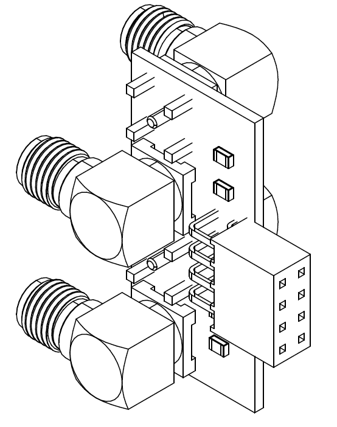

# Terminate Logic

This is an adapter PCB to connect SMA cables to the Saleae Logic Analyzer. It includes 50-Ohm termination.

## Instructions

This is an Altium Designer project. If you don't have Altium all the files you need for fabrication and assembly are in the .zip file. The included [terminate-logic.pdf](terminate-logic.pdf) contains fabrication and assembly instructions.

## Disclaimers

I have not yet assembled or tested this, so fly at your own risk!
